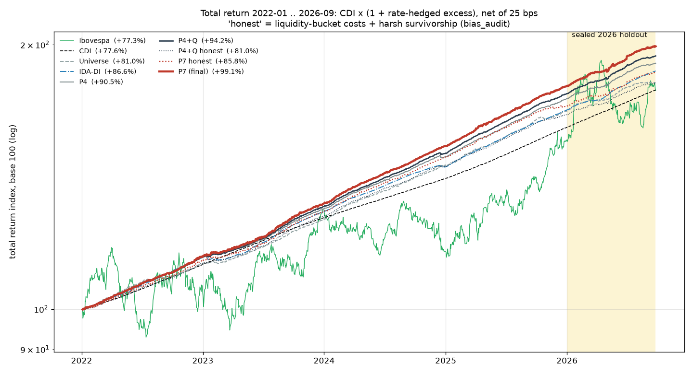
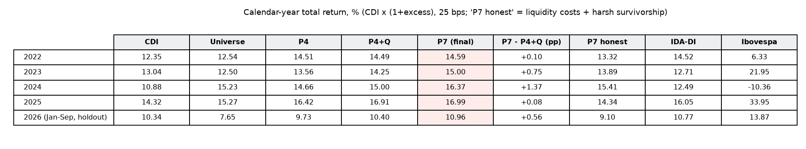
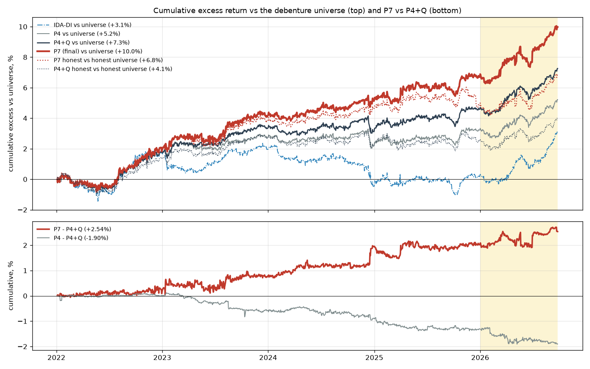
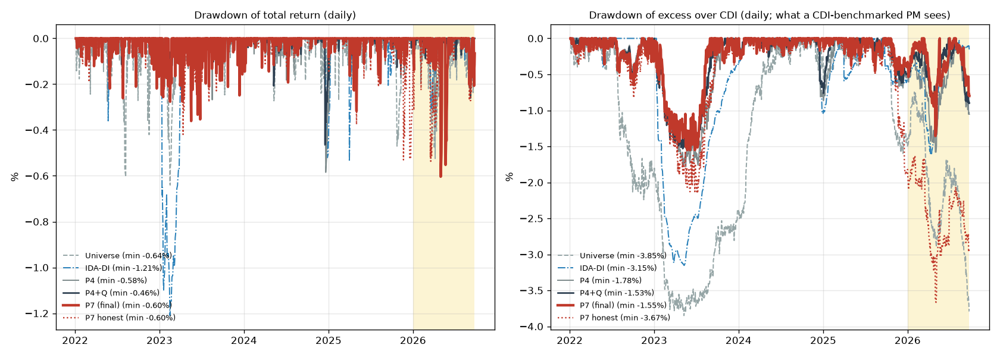
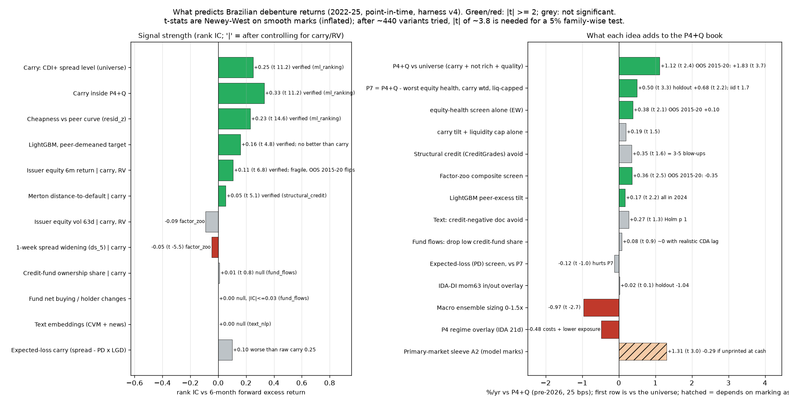

# Nightly research report: Brazilian debentures (2026-09-29)

About 25 research agents ran overnight. Each worked on its own question, and a second set of agents tried to break the best results. Every result uses one shared point-in-time harness, so the numbers can be compared. Two tests are reported separately throughout:
- **Pre-2026 sample:** monthly decisions from 2022 to 2025, used for all research choices.
- **Sealed 2026 holdout:** Jan–Sep 2026, not used for any choice.

## 1. Headline

- **The final model is P7.** It takes P4+Q, drops the issuers with the worst equity health, weights by carry, and caps positions by liquidity for an R$500m fund.

  | test | P7 vs P4+Q, %/yr | t |
  |---|---|---|
  | pre-2026 | +0.50 | 3.3 |
  | 2026 holdout | +0.68 | 2.2 |

  - **In the 2026 holdout**, P7 made +0.76%/yr over CDI. Over the same months the debenture universe lost 3.26%/yr in the credit-fund redemption wave.
  - **Total return from 2022-01 to 2026-09:**

    | P7 | P4+Q | IDA-DI | Universe | CDI | Ibovespa |
    |---|---|---|---|---|---|
    | +99.1% | +94.2% | +86.6% | +81.0% | +77.6% | +77.3% |

- **The honest version of the edge is smaller.** P7 works by avoiding a handful of blow-ups: Oncoclínicas, Americanas and a few others. It is not a broad new source of return.
  - Remove the 3 best months and the gain falls to +0.09%/yr.
  - Out of sample in 2015–2020, P7 adds only +0.12%/yr over P4+Q (t 0.9).
  - About 440 variants were tried overnight. After correcting for that, P7 is not formally significant.
  - Our best estimate of the real gain is **+0.25–0.35%/yr, with smaller drawdowns**.
- **Nothing from wave 2 improved P7, so there is no P8.** Wave 2 covered expected-loss carry, unlisted-issuer health, the new-issue concession and pre-2021 data. The rule for adding anything was fixed before looking at results: it had to add to P7 with t ≥ 2 and pass its verification. No candidate did:

  | candidate | pre-2026 result | why not adopted |
  |---|---|---|
  | unlisted-issuer proxy cascade | +0.13 vs P7 (t 0.9) | not significant |
  | flag vote | +0.10 vs P7 (t 1.3) | not significant |
  | PD screen | −0.12 vs P7 | makes P7 worse |
  | primary-market sleeve | depends on how never-traded bonds are marked | the verifier's replica gave +0.51 (t 1.0) |

- **The main insight tonight is what does not work.** The carry-and-quality core (P4+Q) is the one thing that holds up on new data. It beats the universe by +1.83%/yr (t 3.7) over 72 months from 2015–2020 that were never used before. Almost every smarter layer on top of it fails out of sample, flips sign or is eaten by costs. That covers timing, hedging, ML, text, fund flows and macro.



## 2. What's new tonight

1. **P7, the combined model.** It was pre-registered and it passed its sealed holdout. It combines three wave-1 findings:
   - an equity-implied credit screen;
   - putting more weight in the highest-carry bonds;
   - a construction capped by liquidity.

   The parts add up exactly: the screen gives +0.38 and the construction +0.19, for +0.50 in total.
2. **A true out-of-sample test on 2015–2020.** The whole pipeline was rebuilt from raw sources: SND prints for 2014–20, B3 COTAHIST equities, CVM ITR/DFP 2011–20 and Tesouro curves. On spreads the rebuild matches the 2021 harness at correlation 1.000. This is the first test of our rules through the 2015–16 default cycle and the COVID crash.
3. **An equity-implied credit layer.** Each issuer now has a Merton and CreditGrades distance-to-default and an equity-health score.
   - Americanas sat at the 0.9th percentile of distance-to-default in November 2022, two months before the fraud disclosure.
   - Inside P4+Q, distance-to-default flags 6-month losses worse than −10% with an AUC of 0.91.
4. **A fund-level view of the credit market.** It is built from CVM daily fund reports (inf_diario) and fund holdings (CDA).
   - Credit funds heavy in debentures grew from R$0.25tn to R$1.1tn.
   - Fund flows follow returns rather than lead them.
   - Pressure from forced fund selling is real but lasts about a month.
5. **A primary-market registry** of 4,215 new series from 2021 to 2026.
   - On average new issues carry no discount: they price 16 bps inside the issuer's own curve.
   - A sleeve that buys new issues looks spectacular: +1.31%/yr pre-2026 and +2.49%/yr in the holdout. But 69% of its bonds never trade, so the result comes from how those bonds are marked.
6. **An honest-P&L layer**, from the bias and harness audits.
   - A holiday-accrual bug in the returns is worth −0.13%/yr on every book.
   - Realistic round-trip costs by liquidity bucket are 45–65 bps for DI+ bonds and 136–169 bps for IPCA+ and PRE bonds.
   - In a "harsh survivorship" scenario, bonds that stop trading below par are marked down to 40% of par.
   - Together these cut P4+Q's return level by about 1 pp/yr, but the relative edges survive.
7. **Independent adversarial checks.** The verifier agents found:
   - a real look-ahead leak in the CDA holdings: positions that were still confidential at the time were used;
   - a placeholder-value bug in one factor;
   - several misreported numbers.

   They also built cleaner placebos, which drop comparable names that were not flagged. These showed that the earlier "mechanical +0.16 from dropping listed names" was contaminated, because the random drops often picked the flagged names themselves.

## 3. Final strategy: P7

**Rules**
1. **Candidates (P4+Q):**
   - Top 30% of the universe by CDI+ spread (carry).
   - Not rich against the peer curve (resid_z > −1.5).
   - No negative press in the last 30 days.
   - Drop issuers in the worst quintile of fundamental quality. Issuers with no fundamentals data are kept.
2. **Equity-health screen:**
   - Applies to listed issuers, using their own ticker or a listed parent.
   - The score averages three percentile ranks, taken across the universe's listed names that day: distance from the 52-week high, 63-day volatility (lower is better) and 6-month return.
   - Drop the P4+Q names in the bottom 20%. Unlisted names are kept.
3. **Weights:**
   - Proportional to each bond's CDI+ spread.
   - At most 5% per issuer.
   - Each position at most 25% of the bond's 91-day SND trading volume, sized for R$500m AUM.
4. **Holding:**
   - Open a new tranche of 1/6 of the book every month and hold it about 6 months (126 business days).
   - Buy at each bond's next real trade.
   - No timing overlay and no hedge.

**How to run it**
- **Monthly, on the first business day after the close:**
  1. Refresh the data and get the target weights:
     ```
     PYTHONPATH=. .venv/Scripts/python.exe -c "from research.nightly.combined import p7; w=p7.signals(holdout=True); print(w[w.day==w.day.max()])"
     ```
  2. Buy the new tranche as each bond next trades. Unfilled orders expire after 20 business days.
  3. Let the tranche opened six months earlier roll off.
- **Weekly:**
  - Check fills.
  - Review names that newly fall into the bottom equity-health quintile. They are avoided at entry only; nothing is force-sold.
  - Watch the 2026 redemption wave, because tranches already open still carry its risk.

## 4. Results

**Pre-2026: 48 months, 2022–2025**

Statistics are monthly; t-stats are Newey-West with lag 6. CDI averaged 11.96%/yr.

| book | excess over CDI, %/yr | vs universe (t) | vs P4+Q (t) | vs P4+Q, 2022–23 / 2024–25 | Sharpe | max drawdown | excess over CDI at 50 bps | vs P4+Q at 50 bps (t) |
|---|---|---|---|---|---|---|---|---|
| **P7** | **2.72** | +1.62 (3.5) | **+0.50 (3.3)** | +0.37 / +0.63 | 2.70 | −1.00% | 2.31 | +0.48 (3.1) |
| P4+Q | 2.22 | +1.12 (2.4) | 0 | | 2.13 | −1.39% | 1.84 | 0 |
| P4 | 1.89 | +0.79 (1.6) | −0.33 (−2.3) | | 1.81 | −1.56% | 1.54 | −0.30 |
| Universe | 1.10 | 0 | −1.12 | | 0.74 | −3.51% | 0.89 | |
| IDA-DI | 1.15 | | | | 0.81 | −3.04% | | |
| Ibovespa | 0.59 | | | | 0.03 | −27.1% | | |

**Sealed holdout: Jan–Sep 2026, 9 months, annualised**

| book | excess over CDI, %/yr | vs universe (t) | vs P4+Q (t) | vs P4+Q at 50 bps | max drawdown |
|---|---|---|---|---|---|
| **P7** | **+0.76** | +4.02 (4.5) | **+0.68 (2.2)** | +0.65 (2.1) | −0.67% |
| P4+Q | +0.08 | +3.34 (4.0) | 0 | | −0.78% |
| P4 | −0.73 | +2.53 | −0.81 (−3.7) | | −0.94% |
| Universe | −3.26 | 0 | | | −3.06% |
| IDA-DI / Ibovespa | +0.53 / +5.68 | | | | −0.95% / −12.9% |

**Honest haircut.** Realistic costs by liquidity bucket plus harsh survivorship, applied the same way to every book (from the bias audit).

| | P7 | P4+Q | Universe | P7 vs P4+Q (t) |
|---|---|---|---|---|
| Pre-2026, stops known by 2026-01 | 1.77 | 1.04 | 0.32 | +0.73 (3.4) |
| Pre-2026, stops known by 2026-09 (harsher) | 1.41 | 0.86 | 0.24 | +0.56 (1.8) |
| 2026 holdout | **−1.49** | −2.04 | −4.02 | +0.55 (1.4) |

The first three columns are excess over CDI in %/yr. The holiday-accrual fix takes a further 0.13%/yr off every level.

What this means for planning:
- A realistic P7 earns about **CDI + 1.3–1.6%/yr** in normal years. The worst drawdown of its excess over CDI is about −1.9%, and its Sharpe is about 1.2–1.7.
- In 2026 year to date it is below CDI once realistic costs and bonds that stopped trading are counted. It is still ahead of every other debenture book.
- The Sharpe ratios of 2–3 in the tables above come from smooth, stale marks and overstate risk-adjusted performance.

**Calendar-year total return, %**



| year | CDI | Universe | P4+Q | **P7** | P7 − P4+Q | P7 honest | IDA-DI | Ibovespa |
|---|---|---|---|---|---|---|---|---|
| 2022 | 12.35 | 12.54 | 14.49 | **14.59** | +0.10 | 13.32 | 14.52 | 6.33 |
| 2023 | 13.04 | 12.50 | 14.25 | **15.00** | +0.75 | 13.89 | 12.71 | 21.95 |
| 2024 | 10.88 | 15.23 | 15.00 | **16.37** | +1.37 | 15.41 | 12.49 | −10.36 |
| 2025 | 14.32 | 15.27 | 16.91 | **16.99** | +0.08 | 14.34 | 16.05 | 33.95 |
| 2026 to Sep (holdout) | 10.34 | 7.65 | 10.40 | **10.96** | +0.56 | 9.10 | 10.77 | 13.87 |

- P7 beat P4+Q in every year, but 2022 and 2025 were essentially flat.
- Cumulative excess over the universe from 2022-01 to 2026-09: P7 +10.0%, P4+Q +7.3%, IDA-DI +3.1%. Under honest assumptions: P7 +6.8%, P4+Q +4.1%.




## 5. Verified insights

Each of these survived an independent check unless marked otherwise.



1. **Carry is the signal, and it holds out of sample.**
   - The CDI+ spread level has a rank correlation (IC) with 6-month returns of 0.25 across the universe and 0.33 inside P4+Q (t 11).
   - Cheapness against the peer curve (resid_z) has an IC of 0.23 (t 14.6) and is the most stable signal.
   - No ML model ranks bonds better than these two raw columns.
   - P4+Q beats the universe by +1.12%/yr in 2022–25 and by +1.83%/yr (t 3.7) in 2015–20.
2. **Carry only partly pays for the risk the equity market signals.**
   - Controlling for carry, two equity measures still predict returns: the issuer's 6-month equity return (IC +0.11, t 6.8) and Merton distance-to-default (+0.054, t 5.1).
   - Equity leads bond spreads by 1–4 weeks: a −10% equity week means about 4.6 bps of widening over the next month. That is too small to trade.
   - The value is as a tail filter: the worst distance-to-default quintile caught 94% of the P4+Q names that later lost more than 10%.
3. **Equity health works as a tail filter, not a ranking.**
   - On its own the composite has no rank IC (+0.01). It helps only by removing the bottom tail.
   - Its gain comes from avoiding 3–5 blow-ups: ONCO3, AMER3, DASA3, AERI3 and CSNA3.
   - In 2015–20 the screen alone adds only +0.10%/yr.
4. **Timing does not pay.**
   - None of 20 macro and credit-cycle overlays beats P4+Q.
   - Links between macro variables and credit returns flip sign between 2010–21 and 2022–25. The VIX correlation goes from +0.18 to −0.34; country risk goes from +0.10 to −0.37.
   - The current P4 regime overlay costs 0.48%/yr.
   - Slow 63-day IDA-DI momentum works as drawdown insurance, not as a source of return:
     - it cut the 2020 drawdown from −5.5% to −0.6%;
     - it costs money in normal years;
     - it lost 1.04%/yr in the 2026 holdout.
5. **Fund flows follow returns.**
   - The 21-day credit-fund flow correlates +0.41 with the previous month's P4+Q return. Once lagged returns are included, flow never predicts the next month.
   - The 2023 redemption wave ended while spreads were still near their 200 bps peak, so flow rules exit late and come back late.
6. **Fire-sale pressure is real but short.**
   - Bonds held by funds facing outflows underperform for about a month; avoiding them adds +0.32%/yr (t 2.3). The move then reverses.
   - Harvesting it means about 14x turnover a year, which costs more than it earns.
7. **Company disclosures lag the market.**
   - In the 60 days before a liability-management filing, the bonds lose 1.2%. Hard events hidden inside the PDF text lose 5.1%.
   - Returns after the filing are about 0.
   - Text flags give no early warning of spread blow-outs: they appear no more often before them than on random dates (ratio 0.91–1.04).
8. **New issues carry no discount on average.**
   - New debentures price 16 bps inside the issuer's own curve (t −4).
   - Buying at bookbuilding earns nothing over buying the same bonds at their first trade (−0.37%/yr).
   - The apparent primary-market alpha comes from how never-traded bonds are marked.
9. **Construction matters more than risk models.**
   - Tilting P4+Q toward its highest-carry names is worth about +1.8%/yr on paper. Liquidity limits take most of it away at fund size:

     | fund size | value of the carry tilt, %/yr |
     |---|---|
     | R$50m | +0.99 |
     | R$500m | +0.21 |
     | R$1bn | −0.09 |

   - Risk-based weighting (minimum variance, risk parity, CVaR) loses 0.2–0.4%/yr to equal weight.
10. **Relative value within an issuer is real but already captured.** When one issuer has two bonds, the cheap one beats the rich one by +0.83%/yr (t 6.4). P4+Q already holds the cheap one; only 4% of its slots would change.
11. **About half the unlisted-issuer premium is an artefact.**
    - Unlisted issuers beat listed ones by +0.89%/yr, which falls to +0.46 (t 1.1) under honest assumptions.
    - Unlisted bonds are 2.8 times more likely to stop trading below 98% of par.
    - About two thirds of P7's weight is in issuers the equity screen cannot see.
12. **Sector momentum works across the universe but not inside the book.** Bonds in sectors whose issuers did badly over 3 months keep underperforming (slope −1.6%/yr, t −4.3, in both halves). Inside P4+Q it adds nothing.
13. **The harness's IPCA+ rate hedge over-hedges.** This inflates the credit excess of IPCA+ bonds in 2024–25.

## 6. Ideas that failed

Figures are pre-2026, in %/yr vs P4+Q, unless noted.

| idea | result |
|---|---|
| ML rankers (LightGBM, CatBoost, XGBoost, learning-to-rank, stacking; 51 variants) | −0.5 to −1.5 standalone. The best tilt adds +0.17, all of it in 2024, and only +0.07 over a one-line carry tilt |
| Macro timing | ensemble sizing −0.97 (t −2.7); timing on spread level −1.09; walk-forward models −1.6 to −2.2 of timing alpha |
| Hedges (Ibovespa puts, bank, CDS and equity-beta hedges, volatility targeting, stop-losses) | all ≤ 0 net; the book's equity beta is about 0.003 |
| Text and NLP (embeddings, zero-shot classes, full PDF text) | +0.27 (t 1.3); filings follow the market |
| Fund-flow timing | −0.06 to −0.54 |
| Dropping bonds with a low credit-fund ownership share | +0.08; about 0 with a realistic CDA lag, and the data had a look-ahead leak |
| Bonds that no fund holds ("orphans") | look strong, but sit where stale marks and survivorship bias are worst |
| Expected-loss carry (spread − PD × LGD) | −0.25 to −0.33. As a screen it reduces P7 by 0.12–0.15. Only 37 hard defaults, too few to train on |
| Factor-zoo composite | +0.36 pre-2026, but −0.35 in 2015–20 |
| Network contagion (group, sector, shared fund holders) | 0 inside the book |
| New sleeves (CRI/CRA, FIDC, NTN-B, bank paper) | best +0.14 (t 0.7), and not investable |
| Leverage 1.25–1.5x | only scales up carry, and needs repo funding at CDI+50 bps that does not exist for high-yield names |

## 7. New datasets built

All are point-in-time and cached under `data/history/nightly/<slug>/`.

- **History before 2021:**
  - SND debenture prints 2014–2020.
  - B3 COTAHIST equities 2013–20, with predecessor tickers joined.
  - CVM ITR/DFP financials 2011–20.
  - A rebuilt 2015–20 panel.
- **Funds:**
  - CVM inf_diario daily fund flows.
  - CDA fund holdings (the lag leak is documented).
  - A point-in-time classification of credit funds.
- **Filings and news:**
  - CVM IPE filings 2019–26 for all issuers.
  - Full text of 700 Fatos Relevantes.
  - 46,000 multilingual sentence embeddings.
  - Zero-shot credit-event classes.
- **Issuance and ownership:**
  - The CVM offers registry and issuer supply.
  - The new-issue registry: 4,215 series with bookbuilding rate, regime, lead manager and first print.
  - CVM FRE controller and parent links.
- **Credit and market:**
  - A default and distress event registry from 5 sources.
  - A daily structural-credit table: distance-to-default, CreditGrades, market leverage.
  - Kalman fair spreads, liquidity and Roll cost tables.
  - ANEEL tariff resets.
  - EMBI+, DI×Pre and NTN-B curves.
  - CRI/CRA monthly reports.
  - ANBIMA index history.

## 8. Risks and caveats

- **Concentration.** 94% of P7's gain comes from 10 issuers. Without its top 3 months it adds +0.09%/yr. By year the gain is +0.10, +0.75, +1.37 and +0.08.
- **Multiple testing.** About 440 variants were tried, so a 5% family-wise test needs |t| of about 3.8. P7's Newey-West t is 3.3; its plain t is 1.7, because its monthly differences are negatively autocorrelated. The 9-month holdout is the only clean test, and it contains a single credit episode.
- **Marks.** Smooth, stale and survivorship-biased marks inflate every Sharpe ratio and t-stat. Plan on the honest levels in section 4.
- **Coverage.** The equity screen sees only about a third of P7's weight. The unlisted tail is unscreened, and that is where survivorship bias is concentrated.
- **Capacity.** SND volume includes back-to-back trades between dealers, so real capacity at R$500m is probably lower than modelled.
- **Regime.** 2026 is a credit-fund redemption wave. With realistic costs, every debenture book is below CDI year to date.

## 9. Next steps

1. **Paper-trade P7 from October 2026.** Record real fills against model marks; it is the only way to measure how much stale marks overstate returns.
2. **Use the 63-day IDA-DI momentum flag as a risk dashboard.** Use it to scale new tranches only, and only if drawdown insurance is worth about 0.1–0.4%/yr to the PM.
3. **Keep collecting live evidence on the unlisted-issuer proxy cascade before adopting it.** It adds +0.13 vs P7 pre-2026 and +0.11 in the holdout.
4. **Get real prices before testing the primary-market sleeve again.** It needs ANBIMA indicative prices or dealer quotes for bonds that never trade.
5. **Retest the PD model at end-2026.** It improved in the holdout as more default events were labelled (+0.43 vs P7). Retest with the 2026 events included.
6. **Fix the harness.** Correct the holiday-accrual bug and the IPCA+ over-hedge, and make liquidity-bucket costs the default.

**Charts:** [total return](final/a_total_return.png) · [cumulative excess](final/b_cum_excess.png) · [drawdowns](final/c_drawdowns.png) · [what predicts returns](final/d_what_predicts.png) · [per-year table](final/e_per_year_table.png)

**Details:** each agent's `research/nightly/<slug>/README.md`, plus `combined/README.md`, `p7_adversarial_verification/README.md` and `w2_pre2021_oos_extension/README.md`.